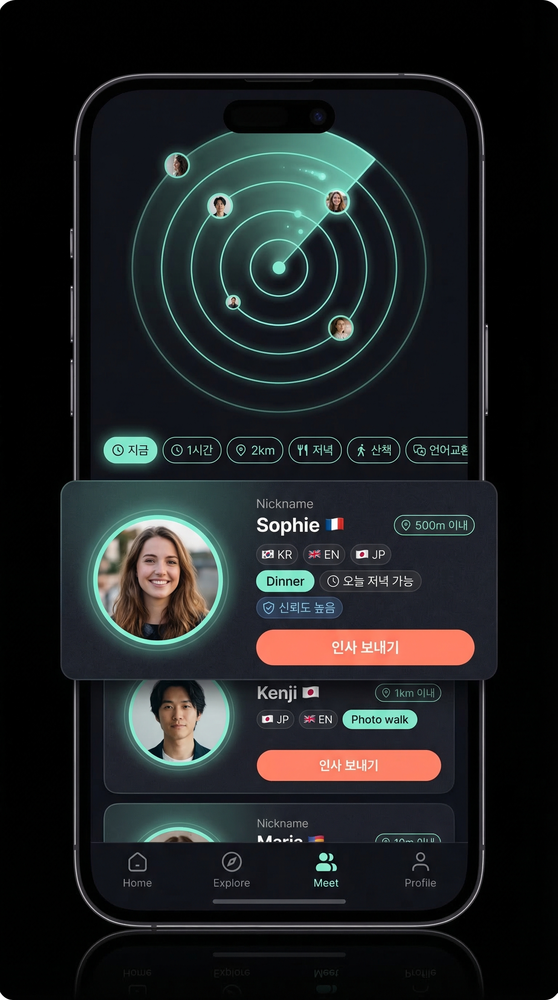
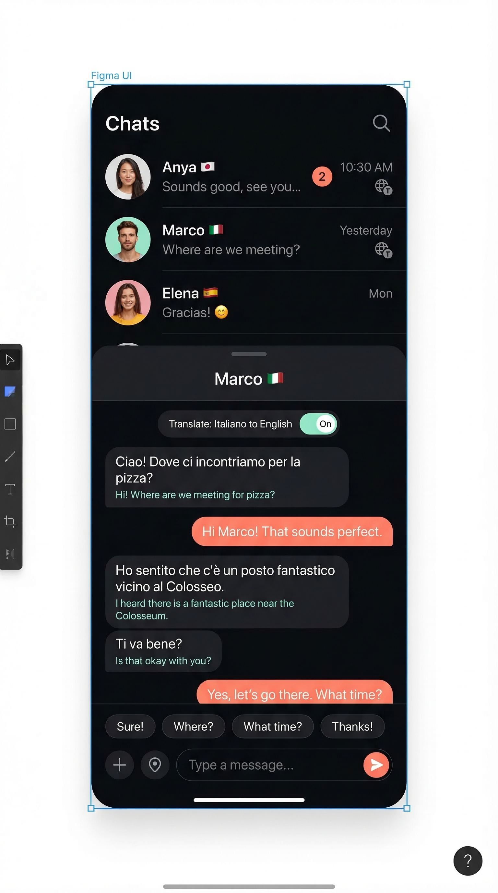
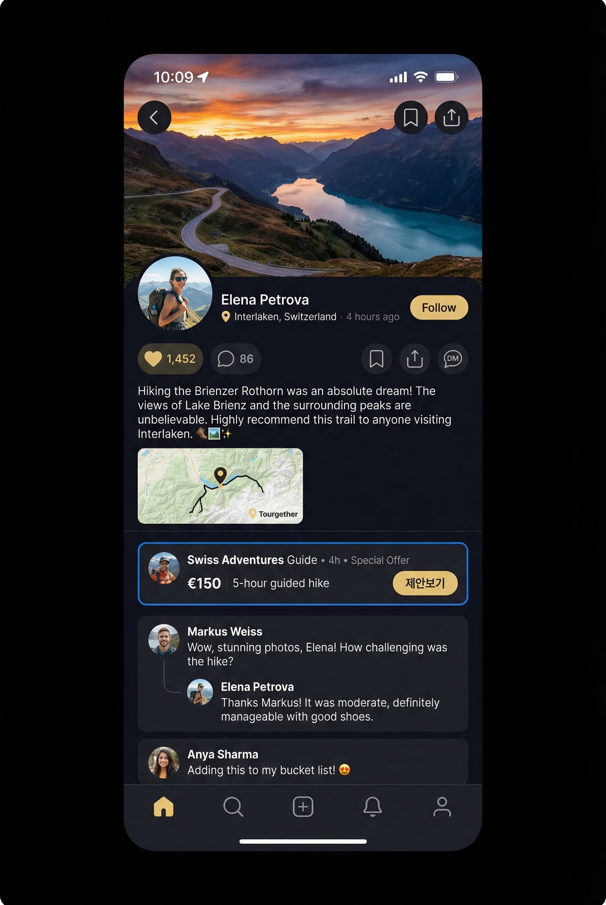
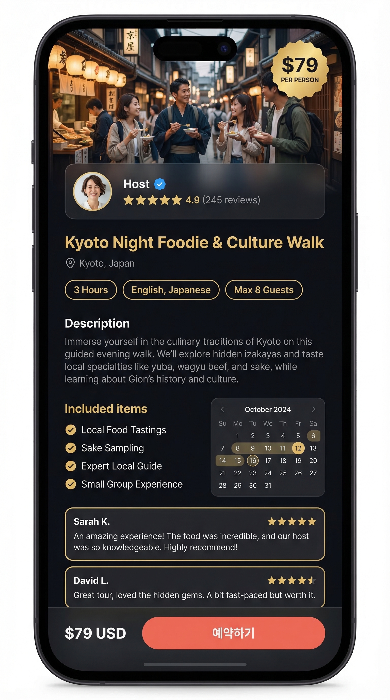
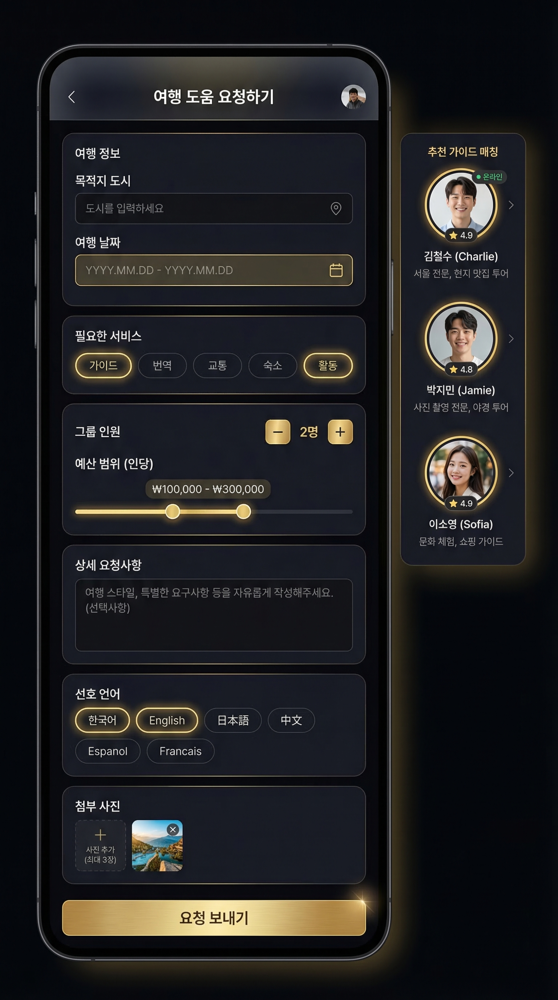
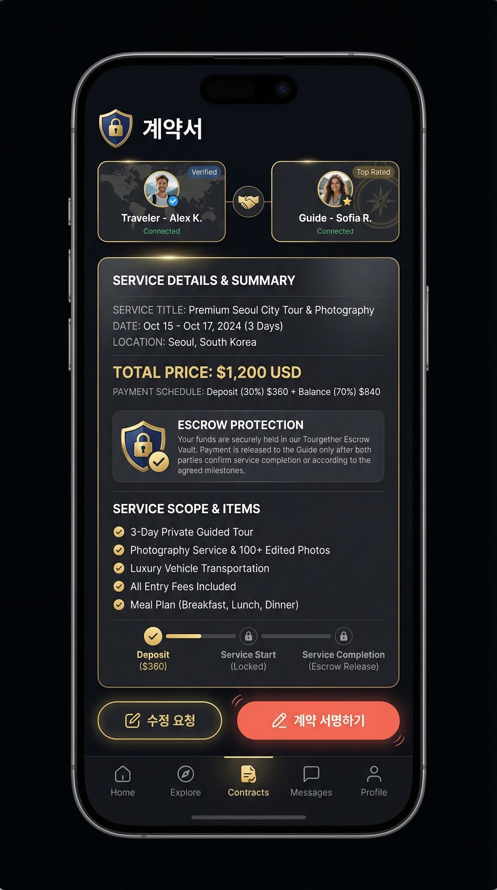
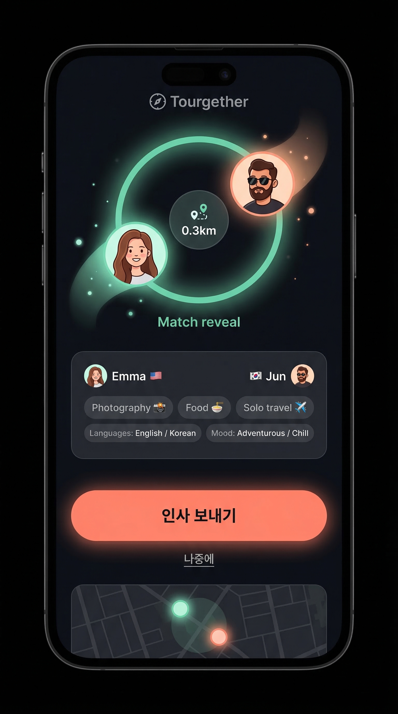

# Tourgether UI/UX 구현 작업지시서 v3 (컨셉아트 기반)
Date: 2026-03-19
Reference concept art: `/tourgether-concepts/` (첨부 이미지 11장)

> **목표**: 아래 컨셉아트 이미지와 90% 이상 일치하는 실제 구현.
> 색만 바꾸는 리디자인 금지. 구조/네비게이션/UX플로우 전체를 바꾼다.

---

## 디자인 토큰 (절대값 — 변경 금지)

```css
/* 배경/서페이스 */
--app-bg: #0A0B10;
--surface-1: #11131A;
--surface-2: #151824;
--stroke: rgba(255, 255, 255, 0.08);

/* 텍스트 */
--text-primary: #F6F7FB;
--text-secondary: #A5AEC4;

/* 액센트 */
--accent-gold: #E6C989;   /* 절제해서 사용 — 강조 포인트만 */
--accent-mint: #7CE7D6;   /* Open to Meet, 번역, 링 */
--accent-coral: #FF8A70;  /* 주요 CTA 버튼 */
--accent-blue: #6BA8FF;   /* 가이드/신뢰 뱃지 */

/* 라운드/깊이 */
--radius-card: 24px;
--radius-sheet: 28px;
--radius-chip: 99px;
```

---

## Ticket 1 — App Shell 재구축

**레퍼런스**: 전체 컨셉아트 공통 하단 네비

### 변경 사항
- `home.tsx` activeTab 상태 + BottomNavigation 라우팅 이중 구조 제거
- 새 `AppShell.tsx` 생성: TopBar + Content Slot + BottomNav 단일 구조
- 5개 탭: `지도 / 탐색 / 만나기 / 채팅 / 나`
- 기존 라우트 호환: `/feed` → explore, `/profile` → me, `/timeline` → cinemap

### 하단 네비 스펙 (컨셉아트 기준)
```
높이: 72px (safe area 제외)
배경: #11131A + border-top: 1px solid rgba(255,255,255,0.08)
아이콘 크기: 24px
레이블: 11px, text-secondary
활성 상태: 아이콘 + 레이블 모두 --accent-mint
만나기 탭: 아이콘 배경에 mint glow ring 효과
FAB(+) 버튼: 완전 제거
```

---

## Ticket 2 — 디자인 토큰 및 유틸리티 클래스

### 추가할 CSS 유틸리티
```css
.tg-surface       { background: var(--surface-1); border: 1px solid var(--stroke); }
.tg-surface-2     { background: var(--surface-2); }
.tg-glass         { background: rgba(17,19,26,0.85); backdrop-filter: blur(20px); }
.tg-chip          { border-radius: 99px; padding: 6px 14px; background: var(--surface-2); border: 1px solid var(--stroke); font-size: 13px; color: var(--text-secondary); }
.tg-chip-active   { border-color: var(--accent-mint); color: var(--accent-mint); }
.tg-bottom-sheet  { border-radius: 28px 28px 0 0; background: var(--surface-1); border-top: 1px solid var(--stroke); }
.tg-btn-primary   { background: var(--accent-coral); color: #fff; border-radius: 99px; }
.tg-btn-ghost     { border: 1px solid var(--stroke); color: var(--text-primary); border-radius: 99px; }
```

---

## Ticket 3 — 지도(Map) 탭

**레퍼런스 이미지**: `map-tab.png`


### 구현 스펙

**TopBar overlay (지도 위에 float)**
```
position: absolute; top: 0; left: 0; right: 0; z-index: 10;
padding: 12px 16px;
배경: linear-gradient(to bottom, rgba(10,11,16,0.9) 0%, transparent 100%)

좌측: 현재 도시명 (서울 강남구) — text-primary 16px semibold
중앙: 검색 pill — frosted glass, "어디 / 누구 / 분위기" placeholder
우측: 알림 벨 아이콘
```

**필터 칩 행 (TopBar 바로 아래)**
```
horizontal scroll, no scrollbar
칩: Nearby / Stories / Meet / Food / Photo
기본: .tg-chip
활성: .tg-chip-active (mint 테두리+텍스트)
```

**사람 마커 (PeopleMarker)**
```
원형 아바타 48px
테두리: 2px solid #11131A
Open-to-Meet 상태: 외곽에 mint glow ring (box-shadow: 0 0 0 3px #7CE7D6)
마커 하단: 상태 레이블 pill (Dinner / Photo / Walk) — 8px, surface-2 배경
클러스터: 3+ 마커 겹칠 때 숫자 뱃지
```

**바텀시트 (3단계 snap)**
```
collapsed: 높이 120px — 타이틀 "지금 1시간, 뭐 하지?" + 드래그 핸들
half: 높이 50vh — 추천 카드 3개 (아바타+제목+거리+CTA)
expanded: 높이 90vh — 필터 + 상세 목록

추천 카드 1개:
- 좌: 아바타 40px
- 중: 제목 14px + 거리/시간 12px text-secondary
- 우: 버튼 (보기/참여/저장)
```

**마커 탭 → 인물 시트 전환**
```
마커 탭하면 바텀시트 내용이 인물 카드로 전환:
- 대형 아바타 64px
- 닉네임 + 언어 칩 + 거리
- 현재 활동 태그 (저녁 먹을 사람 / 사진 같이 / 산책)
- CTA 행: 인사 보내기(coral) / 프로필 보기 / 채팅하기
```

---

## Ticket 4 — 탐색(Explore) 탭

**레퍼런스 이미지**: `explore-tab.png`


### 구현 스펙

**세그먼트 컨트롤**
```
추천 / 주변 / 릴스 / 로컬호스트 / 경로
스타일: pill 형태, 활성=surface-2+mint underline, 비활성=투명
```

**히어로 카드 (첫 번째 블록)**
```
높이: 260px
전체 너비 이미지
하단 그라디언트 오버레이: linear-gradient(transparent, #0A0B10)
오버레이 위: 작성자 아바타 32px + 이름 + 위치 핀 + 장소명
반응 행: ♥ 숫자 / 💬 숫자 / 🔖 / 공유 / DM
우측 하단 CTA pill: "지도에서 보기"
radius: 24px
```

**피드 모듈 믹스 순서**
1. 히어로 카드
2. 릴스 카드 (16:9, 재생 아이콘 overlay)
3. 로컬호스트 스포트라이트 (아바타 large + 별점 + 서비스 태그들)
4. 루트 프리뷰 카드 (지도 썸네일 + 경유지 dots)
5. 미니 컨시어지 추천 행 (수평 스크롤 소형 카드)

**카드 공통 스펙**
```
배경: var(--surface-1)
border: 1px solid var(--stroke)
radius: 24px
padding: 16px
margin-bottom: 12px
```

---

## Ticket 5 — 만나기(Meet) 탭

**레퍼런스 이미지**: `meet-tab.png`



### 구현 스펙

**레이더 시각화 (상단 40%)**
```
원형 SVG 레이더: 동심원 3개 (반투명 mint stroke)
배경: radial-gradient(circle, rgba(124,231,214,0.05) 0%, transparent 70%)
중심: 내 아바타 48px + mint ring
주변 아바타 dots: 4-5개, 거리에 따른 위치
pulse 애니메이션: 2초 주기 slow glow
```

**필터 칩 행**
```
지금 / 1시간 / 2km / 저녁 / 산책 / 언어교환
horizontal scroll
```

**매칭 카드**
```
높이: 80px per card
레이아웃:
  좌: 아바타 52px + 온라인 dot
  중: 닉네임 14px bold + 국기 이모지
      언어 칩들 (KR EN JP) — 소형
      활동 의도 태그 (저녁 🍜 / 포토워크 📸)
      거리 + 가용 시간 — text-secondary 12px
  우: 신뢰 뱃지 + "인사 보내기" coral 버튼

border: 1px solid var(--stroke)
배경: surface-1
radius: 20px
```

---

## Ticket 6 — 채팅(Chat) 탭

**레퍼런스 이미지**: `chat-tab.png`



### 구현 스펙

**DM 목록**
```
각 행: 아바타 48px + 이름+국기 + 마지막 메시지 + 시간 + 미읽 뱃지
번역 있는 대화: 번역 아이콘 (mint) 표시
border-bottom: 1px solid var(--stroke)
```

**메시지 뷰**
```
헤더: 아바타 + 이름 + 언어쌍 (KR↔EN) + 번역토글
내 버블: 우측, --accent-coral 배경, 흰 텍스트, radius 18px 18px 4px 18px
상대 버블: 좌측, surface-2 배경, text-primary
번역문: 버블 하단 mint 12px 이탤릭
번역토글: 버블 우측 탭 (원문/번역 전환)
```

**퀵리플라이 칩**
```
Sure! / Where? / What time? / Thanks! / 나중에
수평 스크롤, .tg-chip 스타일
```

**컴포저**
```
배경: surface-2
좌: 첨부(+) / 위치 / 제안
중: 텍스트 입력
우: 전송 버튼 (coral)
```

---

## Ticket 7 — 나(Me/Profile) 탭

**레퍼런스 이미지**: `profile-me-tab.png`


### 구현 스펙

**히어로 섹션**
```
상단: 커버 무드 이미지 (여행 사진) 200px
     하단 40% 그라디언트 오버레이 → #0A0B10
아바타: 64px, 커버 하단에 -32px overlap, mint ring (open-to-meet 시)
이름: 20px semibold + 국기 이모지
현재 도시: text-secondary 14px
언어 칩: KR / EN / JP — .tg-chip
한줄 소개: 14px text-secondary
```

**뱃지 행**
```
Traveler / Creator / Local guide / Host
아이콘 + 텍스트 pill, gold accent border
```

**CTA 행**
```
팔로우 (.tg-btn-ghost) / 채팅 (.tg-btn-ghost) / 같이 만나기 (.tg-btn-primary coral)
```

**탭 (1레이어 — 4개만)**
```
포스트 / 루트 / 저장 / 서비스(조건부)
나머지 (예약/슬롯/서비스템플릿) → Tools sheet로 이동
```

---

## Ticket 8 — 피드 포스트 상세

**레퍼런스 이미지**: `feed-post-detail.png`



### 구현 스펙

```
상단: 전체너비 여행 사진 히어로 (300px)
     좌상단: 뒤로가기 / 우상단: 저장+공유
작성자 행: 아바타 40px + 이름 + 위치핀+장소명 + 시간 + 팔로우 버튼
반응 행: ♥ / 💬 / 🔖 / 공유 / DM
본문 텍스트
지도 썸네일 (위치 표시)
댓글 섹션:
  - 일반 댓글: 아바타 + 이름 + 내용
  - 오퍼 댓글 카드: blue border, 가이드 프로필 + 가격 + 기간 + "제안 보기" CTA
    (이 카드가 기존 일반 댓글과 시각적으로 명확히 구분)
```

---

## Ticket 9 — 여행 경험 상품 상세

**레퍼런스 이미지**: `experience-detail.png`



### 구현 스펙

```
히어로 이미지: 전체너비 260px
가격 뱃지: 우상단 overlay — gold #E6C989 배경, 검정 텍스트
호스트 카드: 아바타 + 인증뱃지 + 별점 + 리뷰수
서비스 제목 + 위치
정보 칩: 소요시간 / 언어 / 그룹사이즈
설명 텍스트 (접기/펼치기)
포함사항 체크리스트
미니 달력 가용성
리뷰 카드 2-3개
하단 sticky 바: 가격(USD) + 예약하기(coral CTA)
```

---

## Ticket 10 — 여행 도움 요청서

**레퍼런스 이미지**: `service-request.png`



### 구현 스펙

```
헤더: 여행 도움 요청하기
폼 카드들 (.tg-surface):
  - 목적지 도시 입력
  - 날짜 범위 피커
  - 서비스 유형 칩 선택 (가이드/번역/교통/숙소/활동)
  - 인원 수 stepper
  - 예산 범위 슬라이더 (gold accent)
  - 설명 textarea
  - 언어 선호 다중선택 칩
사진 첨부 영역
우측/하단: 매칭 가이드 3명 미리보기 (아바타 + 이름 + 별점)
제출 버튼: coral .tg-btn-primary
```

---

## Ticket 11 — P2P 에스크로 계약

**레퍼런스 이미지**: `contract-screen.png`



### 구현 스펙

```
헤더: 계약서 + 🔒 아이콘
양측 카드: 여행자 아바타(좌) + 악수 아이콘(중) + 가이드 아바타(우)
계약 요약 카드 (.tg-surface):
  - 서비스 제목
  - 날짜 + 위치
  - 총 금액 (USD, gold accent)
  - 결제 일정 (보증금 30% + 잔금)
에스크로 보호 뱃지 (설명 포함)
서비스 범위 체크리스트
결제 마일스톤 타임라인
서명 CTA: 계약 서명하기(coral) + 수정 요청(ghost)
```

---

## Ticket 12 — 세렌디피티 매칭 순간

**레퍼런스 이미지**: `serendipity-moment.png`



### 구현 스펙

```
배경: #0A0B10 + radial mint glow 중앙
중앙 매칭 시각화:
  - 두 아바타 원이 서로 가까워지는 애니메이션
  - mint ring 겹침 효과
  - 거리 뱃지: 0.3km
매칭 상세 카드:
  - 양측 유저 요약
  - 공통 관심사 칩 (사진/음식/솔로여행)
  - 사용 가능 언어
  - 현재 기분 태그
지도 미니뷰: 두 점이 수렴하는 모습
CTA: 인사 보내기(coral, 크게) + 나중에(ghost, 작게)
애니메이션: 링 pulse 2초 주기
```

---

## 구현 순서 (반드시 이 순서로)

1. Ticket 1 — AppShell 통일 (이게 안되면 나머지 다 꼬임)
2. Ticket 2 — 디자인 토큰 + CSS 유틸리티
3. Ticket 3 — 하단 네비
4. Ticket 4 — Map 탭
5. Ticket 5 — Explore 탭
6. Ticket 6 — Meet 탭
7. Ticket 7 — Chat 탭
8. Ticket 8 — Profile/Me 탭
9. Ticket 9 — 피드 상세
10. Ticket 10 — 경험 상품 상세
11. Ticket 11 — 요청서
12. Ticket 12 — 계약 화면
13. Ticket 13 — 세렌디피티 순간

---

## Guardrails

- 컨셉아트 이미지와 90% 이상 일치 목표
- 밝은 흰색 카드 사용 금지 (인증 영역 제외)
- Gold(#E6C989) 남용 금지 — 포인트 강조에만
- 기존 데이터 훅/API 재사용 (구조만 변경)
- 랜딩페이지/SEO 라우트 건드리지 말 것
- 모바일 뷰포트 우선
- 파일 250줄 초과 시 분리, 400줄 하드맥스
